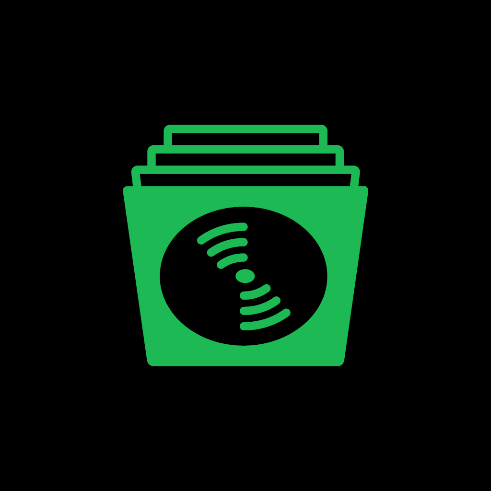
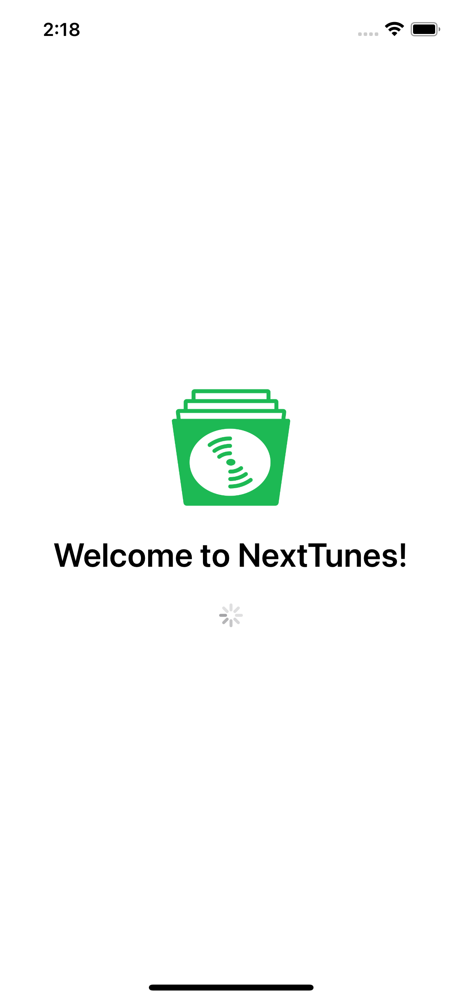
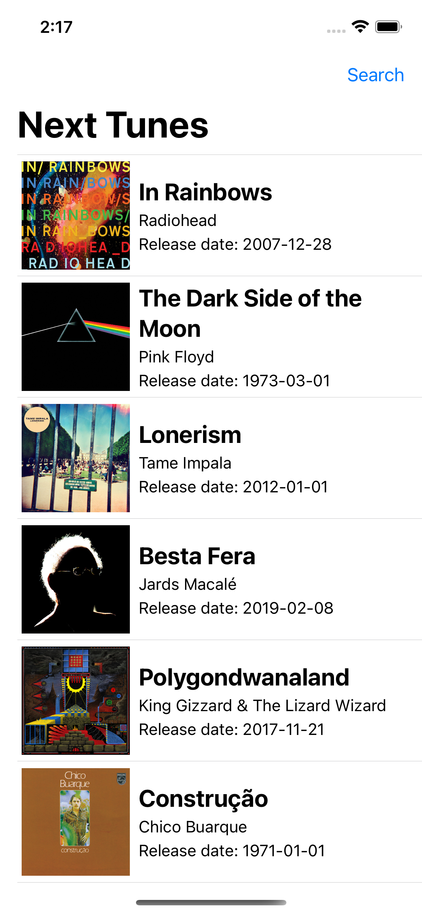
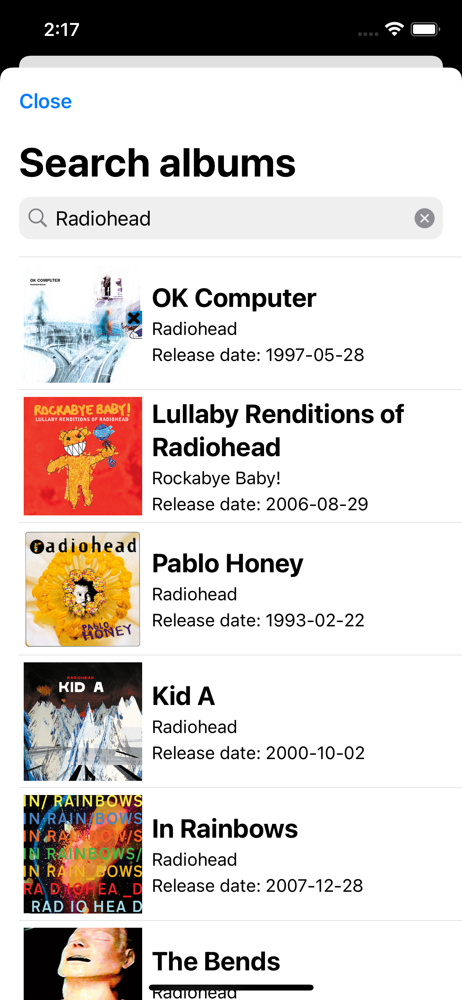

# NextTunes - iOS 

O NextTunes é um app para salvar uma lista de discos para ouvir no Spotify. Desenvolvido com SwiftUI.

# Funcionalidades

- Linguagem: Swift 5
- Interface desenvolvida utilizando SwiftUI
- Integração com API do Spotify (Auth e Search)
- Suporte a 1 idioma (Português)
- Dependências com Swift Package Manager (SPM)

# Iniciando os trabalhos

1. Clone esse repositório 
2. Abra o arquivo `NextTunes.xcodeproj`
3. Configure o header Authorization no arquivo `SpotifyAuthAPIClient.swift`
4. Faça um build e rode o projeto ▶️

# Pessoas Contribuidoras

- Rodrigo Borges - [GitHub](https://github.com/rdgborges) / [LinkedIn](https://www.linkedin.com/in/rdgborges/)

# Sobre a Devpass

A Devpass é uma comunidade de pessoas desenvolvedoras de alto potencial acelerando suas carreiras através de desenvolvimento de produtos reais, como o Hereminders, e conexões com as principais lideranças de tecnologia do país, através de mentorias particulares e Tech Talks.

Se interessou? Acesse www.devpass.com.br e se inscreva na nossa lista para ficar por dentro das novidades!
